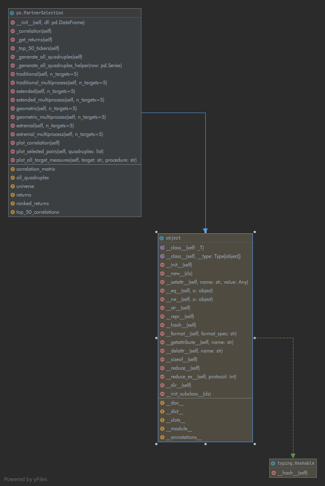

This project contains implementation of the four partner selection approaches mentioned in Section 3.1.1 of Statistical Arbitrage with Vine Copulas. by Stübinger, Johannes; Mangold, Benedikt; Krauss, Christopher.

Please refer to the jupyter notebook for a representation of the code present in this project.

### Files/Folder Structure

- data folder : Contains csv files representing daily pricing data for all stocks in S&P 500.  
- PartnerSelection.ipynb : Notebook contains code execution and results.
- partner_selection.py : Contains PartnerSelection class.
- ps_utils.py : Contains helper functions for PartnerSelection.
- utils_multiprocess.py : Contains helper functions for multiprocessing implementations.
- tests.py : Contains python unittests.

### Project Requirements

- mlfinlab
- pandas
- numpy
- matplotlib
- seaborn
- statsmodels
- scipy

### Way of work

Initially, I tried to get a clear understanding of the problem statement, and the research paper. Then, I focussed on
writing a basic implementation of the traditional and geometric approaches as these were comparatively straight forward.
During this process, I outlined a structure for the class and made sure that all the preprocessing steps were called from __init__ itself.
Later, I turned my attention to the extended approach which involves calculating the multivariate Spearman 's correlation.
As this calculation is fairly complex, initially I tried to write a basic implementation using double for loops.
This process gave me the opportunity to understand the logic better and test for any bugs. 

After I was happy with the results, I started writing unittests for these implementations fairly early on in the project which gave me flexibility to make changes later. 
Later on, I started adding docstrings and inline comments to the methods and classes. The extremal approach was by far the toughest part of the project. It involved a fairly deep understanding of Mangold (2015)
and the calculations that were needed were complex. I tried to analytically solve the steps given in guide,
which made the conversion to code pretty straighforward.

On the next iteration of all the approaches, I worked on optimizing the code by using numpy vectorization techniques and this resulted in dramatic improvements in speed.
To further optimize the code, I implemented multiprocessing wrappers for all four approaches by using mlfinlab multiprocessing techniques.
I implemented test cases for these wrappers as well. Finally, I worked on plotting and documenting the results.

### Design choices

1) Created a class for Partner Selection, where all four procedures were implemented in different methods.
2) Made the class very clear and concise, returns and correlation matrix were calculated in __init__ itself and stored as attributes, since they are frequently used.
3) Each implementation method has a seperate helper method for calculating the corresponding correlations or measures for quadruple selection.
   These helper functions are present in a seperate file (ps_utils) to keep the PartnerSelection class concise.
4) All four procedures also have a multiprocessing method in the PartnerSelection class which use helper functions kept in a seperate (utils_multiprocess.py) file.
5) Methods for plotting were included in the class itself to provide extra functionality.

### Learnings
- Speeding up calculations by using vectorization resulted in about 30 times improvement in speed.
- Used mp_pandas_obj from mlfinlab for further improvement in speed due to multiprocessing.

### UML Diagram

